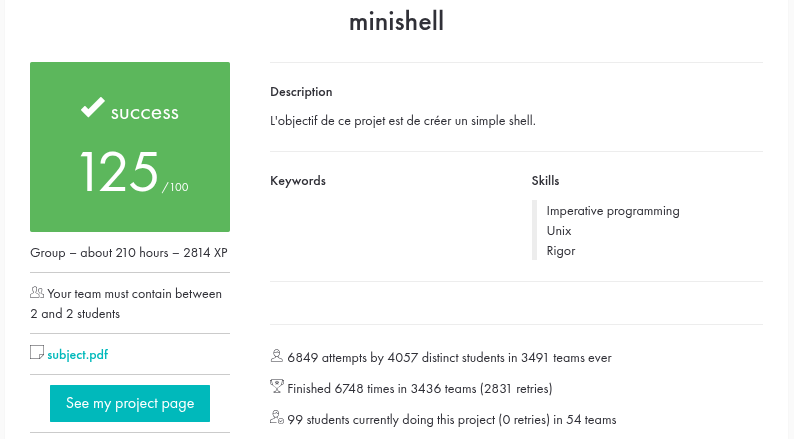

# minishell

A simple Unix shell built from scratch in C, replicating the core behavior of `bash`: parsing, expansion, pipes, redirections, job execution and signal handling — with no use of a shell-parsing library.

[42 School](https://42.fr) project — final grade **125 / 100**.



## Features

**Parsing & execution**
- Command parsing into an abstract syntax tree (pipelines, subshells, logical operators)
- Pipes (`|`)
- Subshells (`( ... )`)
- Logical operators (`&&`, `||`)
- Redirections: `<`, `>`, `>>`, and heredoc `<<`
- Environment variable expansion (`$VAR`, `$?`) and single/double quote handling
- Filename wildcard expansion (`*`)
- Correct exit-status propagation (`$?`)

**Builtins**
- `cd`, `echo`, `env`, `exit`, `export`, `pwd`, `unset`

**Signals**
- `Ctrl-C`, `Ctrl-D` and `Ctrl-\` behave like in `bash`, both at the prompt and while a command or heredoc is running

## Build

```sh
make          # build minishell
make bonus    # build minishell_bonus
make clean    # remove object files
make fclean   # remove object files and binaries
make re       # rebuild from scratch
```

The binary links against `readline` and statically builds an in-house `libft`.

## Usage

```sh
./minishell
```

```
minishell$ echo "Hello, World!" | cat -e
Hello, World!$
minishell$ ls *.c | wc -l
34
minishell$ (echo a && echo b) | grep b
b
```

## Project structure

The codebase is organized by feature: every module keeps its `.c` files and its own header side by side, aggregated by a single umbrella header.

```
srcs/
├── builtins/   shell builtins (cd, echo, env, exit, export, pwd, unset)
├── core/       entry point, shell lifecycle, cleanup, error reporting
├── env/        environment list management
├── exec/       command / pipeline / subshell execution, redirections
├── expand/     variable expansion, quote removal, wildcard expansion
├── parse/      tokenizer, AST builder, heredoc handling
└── signal/     signal handlers
includes/
└── minishell.h aggregates every feature header + system includes
libft/          in-house standard library replacement
```

Dependency tracking is handled with `-MMD -MP`, so only the object files that actually depend on a changed header are rebuilt. The whole codebase is [42 Norm](https://github.com/42School/norminette) compliant.

## Authors

- [davsam97](https://github.com/davsam97)
  
